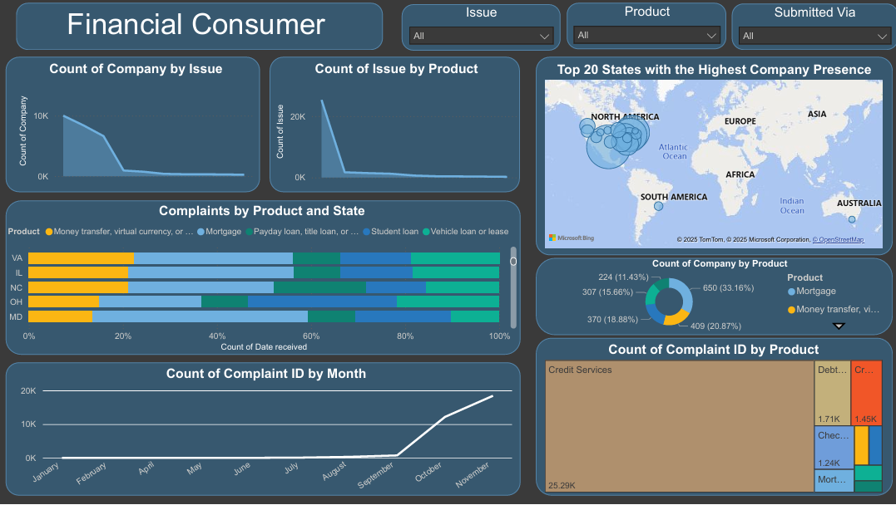

# Financial Consumer Complaints Data Analysis



## Overview
This project analyzes and visualizes consumer complaints related to financial products and services. The dataset contains complaints filed by consumers, along with company responses and other metadata, making it valuable for trend analysis, customer sentiment tracking, and evaluating company performance.

## Dataset Information
The dataset includes the following key columns:
- **Date received** – When the complaint was received.
- **Product** – The financial product category.
- **Sub-product** – A more specific financial product.
- **Issue** – The main issue reported.
- **Sub-issue** – A more detailed description of the issue.
- **Consumer complaint narrative** – A textual description of the complaint (if provided).
- **Company public response** – The company’s public response.
- **Company** – The financial institution involved.
- **State** – The U.S. state from which the complaint originated.
- **ZIP code** – ZIP code of the consumer (if available).
- **Tags** – Metadata such as "Older American" or "Servicemember."
- **Consumer consent provided?** – Whether the consumer consented to sharing details.
- **Submitted via** – The method used to submit the complaint (e.g., Web, Phone, Email).
- **Date sent to company** – When the complaint was forwarded to the company.
- **Company response to consumer** – The company’s response.
- **Timely response?** – Whether the company responded on time.
- **Consumer disputed?** – Whether the consumer disputed the company’s resolution.
- **Complaint ID** – A unique identifier for each complaint.

## Project Workflow
### 1. **Exploratory Data Analysis (EDA)**
- Used **Google Colab** and **Jupyter Notebook** for data exploration.
- Inspected data types, missing values, and patterns in the dataset.
- Identified key insights regarding complaints and company responses.

### 2. **Data Cleaning & Preprocessing**
- **Dropped unnecessary columns** to reduce redundancy.
- **Checked for duplicate records** and removed them.
- **Handled missing values**:
  - General missing values were filled using appropriate methods.
  - **Used KNNImputer to fill missing values in the 'Consumer disputed?' column** by leveraging similarities in the dataset.
- **Standardized column names** by replacing spaces with underscores for better accessibility in Python.

### 3. **Data Imputation Using KNN**
- Converted 'Consumer disputed?' column to numerical values:
  ```python
  df['Consumer_disputed?'] = df['Consumer_disputed?'].map({'Yes': 1, 'No': 0})
  ```
- Applied **K-Nearest Neighbors Imputer (KNNImputer)** to fill missing values:
  ```python
  from sklearn.impute import KNNImputer
  
  imputer = KNNImputer(n_neighbors=5)
  df[['Consumer_disputed?']] = imputer.fit_transform(df[['Consumer_disputed?']])
  ```
- Mapped imputed values back to categorical 'Yes' or 'No':
  ```python
  df['Consumer_disputed?'] = df['Consumer_disputed?'].apply(lambda x: 'Yes' if x >= 0.5 else 'No')
  ```

### 4. **Data Visualization using Power BI**
- **Map Visual**: Displaying the top 20 states with the highest complaints.
- **Doughnut Chart**: Showing distribution of complaints by company and product.
- **Additional Visuals**: Trend analysis, company response time evaluation, and more insights on consumer behavior.

## Performance Considerations
- **KNNImputer can be slow for large datasets** due to distance calculations. Optimization strategies include reducing `n_neighbors` and selecting relevant features.
- Considered alternative imputation methods (e.g., mode filling) but found KNN more suitable for preserving relationships in the data.

## Future Improvements
- Enhancing the Power BI dashboard with interactive filters and deeper trend analysis.
- Using machine learning models for predictive insights on consumer disputes.
- Automating the data preprocessing workflow for continuous updates.

**Adham Sameh** – Data Analyst | Machine Learning Enthusiast

